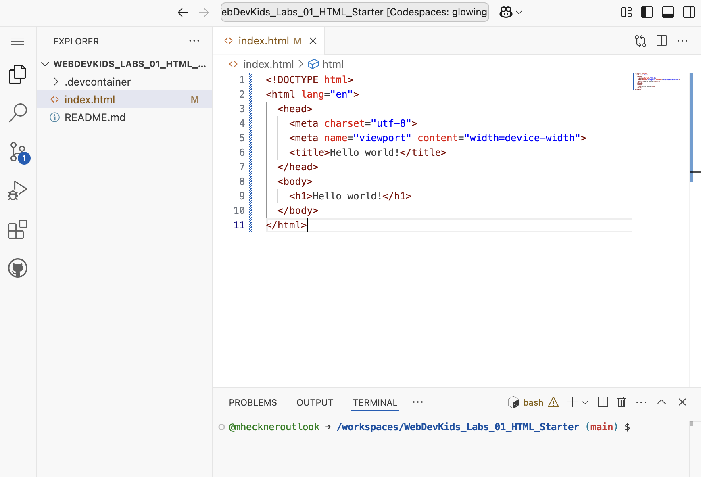

# Setup

## Registrieren

Registrieren Sie sich unter  [http://github.com](http://github.com) mit Ihrer studentischen E-Mailadresse. Verwenden Sie einen Usernamen, unter dem man Sie identifizieren kann (beispielsweise mheckner für Markus Heckner).

## Startercode
Um möglichst schnell mit der Entwicklung zu starten zu können, erhalten Sie für dieses Lab einen Startercode.

1. Klicken Sie auf den folgenden [Link](https://github.com/OTHRegensburgWebDevKIDS/WebDevKids_Labs_01_HTML_Starter)
2. Klicken Sie auf den Button "<> Code", dann auf "Codespaces" und abschließend auf "Create codespace on main" - Es öffnet sich ein neuer Tab und ein Codespace wird für Sie eingerichtet.
3. **GANZ WICHTIG: Lassen Sie sich Zeit bevor Sie weitermachen:** Die erste Einrichtung eines neuen Codespaces kann mehrere Minuten dauern. Denken Sie an einen Stein, den Sie ins Wasser geworfen haben und warten Sie, bis das Wasser wieder völlig ruhig ist.

## Web IDE Codespaces

Die IDE Codespaces besteht aus 3 Elementen:


- **Explorer** (linke Seite) zur Auswahl der zu editierbaren Files (hier erstmal nur `index.html`)
- **Editor** (Mitte) zur Bearbeitung des Quellcode (hier mit geöffneter Datei ```index.html```)
- **Terminal** (unten) - hier können Sie Kommandos eingeben, wie beispielsweise einen Webserver starten.


## Webseite im Browser anzeigen

Testen Sie zu Beginn, wie Sie die Webseite in Codespaces anzeigen können.
1. Öffnen Sie die Datei ```index.html``` und sehen sich den Inhalt im Editor an.
2. Geben Sie auf dem Terminal den Befehl ```live-server``` ein, um den Webserver zu starten.
3. Es öffnet sich automatisch ein neuer Browsertab und Sie sehen Ihre Webseite. Ggf. müssen Sie das Öffnen des neuen Tabs noch bestätigen.
4. Ändern Sie den Text ```<h1>Hello, world!</h1>``` auf ```<h1>Hello, there!</h1>```. Der Browsertab sollte sich automatisch, d.h. ohne neues Laden der Seite, aktualisieren.
5. Drücken Sie die Tastenkombination "Strg+C" (Windows) bzw. "Control+C" (Mac), um den Webserver zu beenden (z.B. wenn andere Kommandos auf dem Terminal eingeben wollen).


## Warum Codespaces?

Um den Einstieg in das Thema Web-Development noch einfacher zu gestalten, lässt sich statt einer installierten Entwicklungsumgebung auch ein Online-Editor verwenden.

Mit *Codespaces* kann man in die Webentwicklung einsteigen, ohne eigene Software installieren zu müssen. Sie können den Code mit jedem Gerät, das über einen Internetbrowser verfügt, bearbeiten. Weiterhin bietet *Codespaces* einen eigenen Webserver, um die Seiten direkt im Web zu veröffentlichen.
