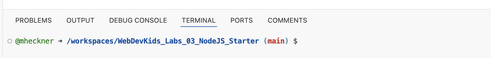

# Hello Node.js

*Node.js* ist eine JavaScript-Laufzeitumgebung, mit dem sich JavaScript Code außerhalb des Browsers ausführen lässt.

Codespaces bietet eine Linux-Kommandozeile auf der sich Shell Kommandos eingeben lassen. Sie finden diese Shell am unteren Rand in Codespaces:



Erstellen Sie mithilfe der replit-Shell mit dem folgenden Befehl einen neuen Ordner `hello_node`:

```shell
mkdir hello_node
```

Wechseln Sie anschließend mit dem folgenden Befehl in diesen Ordner ...

```shell
cd hello_node
```

... und erstellen Sie mit dem folgenden Befehl die Datei `hello_node.js`:

```shell
touch hello_node.js
```

Prüfen Sie, ob die Datei auch im Explorer auf der linken Seite des Codespace-Fensters erschienen ist.

Ergänzen Sie in der Datei `hello_node.js` eine einfache *Hello world!*-Ausgabe wie durch die folgende Zeile:

```js
console.log("Hello world!");
```

Um den Code mit *Node.js* auszuführen, müssen Sie die *node* Laufzeitumgebung vom Terminal mit dem folgenden Befehl starten:

```shell
node hello_node.js
```

Ihr Programm sollte jetzt `Hello world!` auf dem Terminal ausgeben.

*Hinweis:* Node.js lässt sich auch herunterladen und auf dem eigenen Rechner unter dem folgenden Link installieren: [https://nodejs.org](https://nodejs.org).

### Terminal Basics

<details>
<summary>Verzeichnis wechseln</summary>

Mittels des Befehls `cd` können Sie das Verzeichnis wechseln.

In ein Verzeichnis wechseln:

```shell
cd <Name des Verzeichnisses oder Pfad zum Verzeichnis>
```

Ein Verzeichnis zurück gehen:

```shell
cd ..
```

In das Stammverzeichnis wechseln:

```shell
cd ~
```

In das Rootverzeichnis wechseln:

```shell
cd /
```

</details>

<details>
<summary>Dateien und Ordner im aktuellen Verzeichnis ausgeben</summary>

Mittels des Befehls `ls` können Sie sich den Inhalt des aktuellen Verzeichnisses ausgeben lassen.

Ordner und Dateien ausgeben:

```shell
ls
```

Ordner und Dateien im Listenformat ausgeben:

```shell
ls -l
```

Versteckte Dateien ausgeben:

```shell
ls -a
```

</details>
